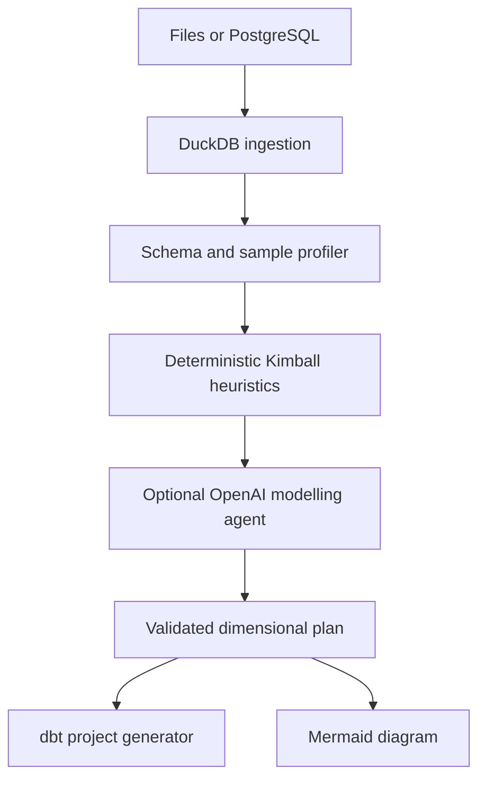

# DW-AI

DW-AI is a local MVP for generating Kimball-style dimensional models from enterprise data sources.

It ingests uploaded files or PostgreSQL schemas, profiles metadata plus bounded row samples, proposes facts and dimensions, and exports a runnable DuckDB/dbt project with a Mermaid diagram.

## What It Supports

First-class MVP inputs:

- CSV and TSV
- XLSX
- Parquet
- JSON and NDJSON
- PostgreSQL schema introspection through DuckDB's PostgreSQL extension

Language support:

- English and Portuguese UI labels.
- Portuguese-aware profiling for common identifiers such as `id_discente`, `id_disciplina`, `id_pessoa`, `codigo_disciplina`, and `codigo_componente_curricular`.
- Portuguese-aware temporal detection for columns such as `ano`, `periodo`, `ano_ingresso`, `periodo_ingresso`, `ano_nascimento`, `ano_admissao`, and `ano_desligamento`.
- Portuguese academic transaction names such as `matriculas` are treated as fact candidates.

Future-compatible source families:

- SQLite, MySQL, SQL Server, Oracle, ODBC/JDBC databases
- Avro, Delta Lake, Iceberg
- S3, GCS, Azure object storage
- BI extracts and governed catalog integrations

## MVP Workflow

1. Upload custom files, load one of the built-in demo datasets, or enter a PostgreSQL connection string.
2. Preview tables, columns, inferred types, samples, null rates, key candidates, and relationship candidates.
3. Generate a dimensional model.
4. Review proposed facts, dimensions, measures, date columns, grains, assumptions, and confidence.
5. Download a dbt project ZIP containing SQL models, YAML docs/tests, and `diagram.mmd`.

Custom uploaded files and demo data are shown together in the app. If the user uploads files, those custom files take precedence and the demo-data loader is disabled to avoid mixing sources in the same run.

The AI integration is optional. If no API key is provided, DW-AI uses deterministic Kimball heuristics so the demo still works offline.

## Deterministic Mode vs AI Mode

DW-AI always runs deterministic profiling first. This part does not use AI:

- Reads tables into DuckDB.
- Counts rows and distinct values.
- Detects null rates, sample values, candidate keys, identifier columns, numeric columns, and temporal columns.
- Infers relationships by comparing identifier names and value overlap.
- Builds a conservative Kimball model from rules.

When an API key is provided in the local UI and the AI toggle is enabled, the app sends only metadata and bounded samples to the selected provider. The AI can improve semantic interpretation, especially when names are ambiguous or in Portuguese, but it does not replace profiling. It receives the deterministic plan as a fallback and should return structured JSON with facts, dimensions, grains, measures, assumptions, confidence, and unresolved questions.

Practical difference:

- Without AI: fast, reproducible, private by default, but limited to naming/statistical heuristics.
- With AI: better business-language interpretation and explanations, but depends on API access and should still be reviewed before production use.

## AI Providers

The MVP supports two OpenAI-compatible providers:

- OpenAI: the paid/default provider. Choose `OpenAI`, paste an OpenAI API key, and use a model such as `gpt-4.1-mini`.
- Groq: the alternate provider. Choose `Groq`, paste a Groq API key, click `Load Groq models`, then select one of the models returned by Groq's `/models` endpoint.

For v1, API keys are entered in the Streamlit sidebar and kept only in local process memory. The app is intended to run on the user's own computer, so no encryption or credential storage is implemented yet.

Environment variable fallback is still supported for local development:

- `OPENAI_API_KEY`
- `GROQ_API_KEY`
- `DW_AI_OPENAI_MODEL`
- `DW_AI_GROQ_MODEL`

## Generated dbt Project

The exported ZIP includes:

- `dbt_project.yml`
- `profiles.yml.example`
- `models/sources.yml`
- `models/staging/stg_*.sql`
- `models/marts/dim_*.sql`
- `models/marts/fct_*.sql`
- `models/marts/schema.yml`
- `diagram.mmd`
- `README.md`

The first target is local DuckDB. Other adapters such as PostgreSQL, BigQuery, and Snowflake can be added later.

## Install

```powershell
python -m pip install -e .[dev]
```

Optional AI configuration for local development:

```powershell
$env:OPENAI_API_KEY = "sk-..."
$env:DW_AI_OPENAI_MODEL = "gpt-4.1-mini"
$env:GROQ_API_KEY = "gsk_..."
$env:DW_AI_GROQ_MODEL = "llama-3.3-70b-versatile"
```

## Run The App

```powershell
python -m streamlit run app.py
```

## Run Tests

```powershell
python -m pytest
```

## Demo Data

If you do not have data ready, use the small CSV scenarios in `test_data/`:

- `test_data/easy_retail`: obvious retail orders pattern for quick validation.
- `test_data/medium_university`: English university data with `students`, `course_components`, `program_courses`, `instructors`, and `enrollments`.
- `test_data/hard_healthcare`: harder clinical and billing data with multiple fact candidates.

Each table has 20 rows or fewer, but includes enough columns to exercise profiling, relationship detection, temporal detection, and dbt generation.

## Architecture



## Code Map

- `app.py`: Streamlit user interface. It handles language selection, file upload or PostgreSQL connection input, displays profiling results, runs model generation, and exposes the dbt ZIP download.
- `dw_ai/ingestion.py`: Loads supported files into an in-memory DuckDB database. CSV/TSV/JSON/Parquet use DuckDB readers; XLSX is read with pandas; PostgreSQL is attached read-only through DuckDB.
- `dw_ai/profiling.py`: Inspects DuckDB tables. It calculates row counts, null rates, distinct counts, unique ratios, sample values, candidate keys, identifier columns, temporal columns, and relationship candidates.
- `dw_ai/modelling.py`: Builds the deterministic Kimball proposal. It decides which tables are fact candidates, which are dimensions, which columns are measures, which identifiers are degenerate dimensions, and when to add `dim_date`.
- `dw_ai/ai_agent.py`: Optional AI refinement layer for OpenAI and Groq. If enabled and configured, it sends compact metadata plus the deterministic fallback plan to the selected provider and validates the JSON response.
- `dw_ai/dbt_generator.py`: Converts the dimensional plan into dbt files: sources, staging views, mart facts/dimensions, tests, docs, profile example, and project config.
- `dw_ai/diagram.py`: Converts the same dimensional plan into Mermaid ER syntax and a compact star-schema overview.
- `dw_ai/artifacts.py`: Packages generated dbt files and the diagram into a downloadable ZIP.
- `dw_ai/models.py`: Pydantic data contracts shared by the pipeline.
- `dw_ai/utils.py`: Small naming, quoting, singularization, and serialization helpers.
- `tests/`: Regression tests for ingestion, profiling, Portuguese academic identifiers, deterministic modelling, and dbt artifact generation.

## Modelling Rules

- Facts represent measurable business events and must state their grain.
- Dimensions hold descriptive context and use generated surrogate keys.
- Date dimensions are generated when temporal fact columns are detected.
- Numeric non-identifier columns become measure candidates.
- Order numbers, invoice numbers, transaction codes, and similar identifiers may become degenerate dimensions.
- Low-confidence joins become assumptions instead of hidden fake relationships.

## Diagram Options

The app now generates two Mermaid files:

- `diagram_compact.mmd`: a readable star-schema overview for humans and presentations.
- `diagram.mmd`: the detailed ER-style diagram with columns.

The compact diagram is the better default for visual review. The full ER diagram is useful for auditing column-level output, but it gets noisy with wide enterprise tables.

For a more polished future UI, good options are:

- Graphviz/SVG rendering for cleaner automatic layouts.
- React Flow for an editable browser canvas.
- dbdiagram.io-compatible DBML export for database-style diagrams.
- Mermaid only as a portable fallback artifact in the dbt ZIP.

## Portuguese Academic Data Notes

The sample academic files `componentes`, `cursos`, `discentes`, `docentes`, and `matriculas` expose why language/domain support matters:

- `id_discente` and `id_disciplina` are real relationship keys, even though they do not follow the English `customer_id -> customers.id` pattern.
- `ano` and `periodo` are temporal analysis fields even when stored as strings.
- `matriculas` is an event/process table and should be considered a fact candidate.
- Partial value overlap can happen when files cover different extraction windows. DW-AI keeps those relationships but records assumptions with confidence percentages so they can be reviewed.

## Academic Goal

DW-AI explores how structural profiling and AI assistance can reduce the manual effort of transforming operational data into dimensional data warehouse models.
